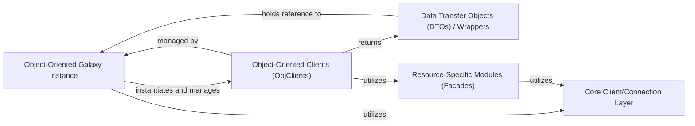

## Details

The `Object-Oriented API Layer & DTOs` component in `bioblend` provides a high-level, Pythonic interface for interacting with the Galaxy API, abstracting away direct API calls. It achieves this through a structured design involving a central instance, specialized clients, and data transfer objects (DTOs) that wrap Galaxy entities.

### Object-Oriented Galaxy Instance

This component serves as the primary entry point for the object-oriented API layer. It initializes and manages the various object-oriented clients and provides a high-level interface to interact with the Galaxy instance using Python objects. It acts as the central orchestrator for the object-oriented paradigm.

**Related Classes/Methods**:

- <a href="https://github.com/galaxyproject/bioblend/blob/main/bioblend/galaxy/objects/galaxy_instance.py#L1-L1" target="_blank" rel="noopener noreferrer">`bioblend.galaxy.objects.galaxy_instance.GalaxyInstance` (1:1)</a>

### Object-Oriented Clients (ObjClients)

These are specialized clients that provide object-oriented methods for interacting with specific Galaxy entities (e.g., histories, datasets, workflows). They abstract the underlying API calls and operate on the DTOs/Wrappers, simplifying resource-specific operations.

**Related Classes/Methods**:

- <a href="https://github.com/galaxyproject/bioblend/blob/main/bioblend/galaxy/objects/client.py#L1-L1" target="_blank" rel="noopener noreferrer">`bioblend.galaxy.objects.client.ObjClient` (1:1)</a>

- <a href="https://github.com/galaxyproject/bioblend/blob/main/bioblend/galaxy/objects/client.py#L1-L1" target="_blank" rel="noopener noreferrer">`bioblend.galaxy.objects.client.ObjHistoryClient` (1:1)</a>

- <a href="https://github.com/galaxyproject/bioblend/blob/main/bioblend/galaxy/objects/client.py#L1-L1" target="_blank" rel="noopener noreferrer">`bioblend.galaxy.objects.client.ObjDatasetClient` (1:1)</a>

- <a href="https://github.com/galaxyproject/bioblend/blob/main/bioblend/galaxy/objects/client.py#L1-L1" target="_blank" rel="noopener noreferrer">`bioblend.galaxy.objects.client.ObjWorkflowClient` (1:1)</a>

### Data Transfer Objects (DTOs) / Wrappers

This component comprises Python classes that wrap Galaxy API entities (like histories, datasets, jobs, workflows) as native Python objects. These objects provide attributes for accessing entity properties and methods for direct manipulation, state refreshing, and interaction with the Galaxy instance, abstracting away direct API calls.

**Related Classes/Methods**:

- <a href="https://github.com/galaxyproject/bioblend/blob/main/bioblend/galaxy/objects/wrappers.py#L63-L167" target="_blank" rel="noopener noreferrer">`bioblend.galaxy.objects.wrappers.Wrapper` (63:167)</a>

- <a href="https://github.com/galaxyproject/bioblend/blob/main/bioblend/galaxy/objects/wrappers.py#L1311-L1520" target="_blank" rel="noopener noreferrer">`bioblend.galaxy.objects.wrappers.History` (1311:1520)</a>

- <a href="https://github.com/galaxyproject/bioblend/blob/main/bioblend/galaxy/objects/wrappers.py#L854-L965" target="_blank" rel="noopener noreferrer">`bioblend.galaxy.objects.wrappers.Dataset` (854:965)</a>

- <a href="https://github.com/galaxyproject/bioblend/blob/main/bioblend/galaxy/objects/wrappers.py#L275-L652" target="_blank" rel="noopener noreferrer">`bioblend.galaxy.objects.wrappers.Workflow` (275:652)</a>

- <a href="https://github.com/galaxyproject/bioblend/blob/main/bioblend/galaxy/objects/wrappers.py#L655-L848" target="_blank" rel="noopener noreferrer">`bioblend.galaxy.objects.wrappers.Invocation` (655:848)</a>

### Core Client/Connection Layer

This component handles the low-level HTTP requests and responses to the Galaxy API. It provides the fundamental communication mechanism for all higher-level clients, ensuring reliable interaction with the Galaxy server.

**Related Classes/Methods**:

- <a href="https://github.com/galaxyproject/bioblend/blob/main/bioblend/galaxyclient.py#L1-L1" target="_blank" rel="noopener noreferrer">`bioblend.galaxyclient.GalaxyClient` (1:1)</a>

### Resource-Specific Modules (Facades)

These modules provide a more direct, procedural interface to specific Galaxy API resources, acting as facades over the core client. The object-oriented clients often utilize these under the hood to perform specific API operations before wrapping the results in DTOs.

**Related Classes/Methods**:

- <a href="https://github.com/galaxyproject/bioblend/blob/main/bioblend/galaxy/client.py#L1-L1" target="_blank" rel="noopener noreferrer">`bioblend.galaxy.client.Client` (1:1)</a>

- `bioblend.galaxy.histories.HistoryClient` (1:1)

- `bioblend.galaxy.datasets.DatasetClient` (1:1)

### [FAQ](https://github.com/CodeBoarding/GeneratedOnBoardings/tree/main?tab=readme-ov-file#faq)