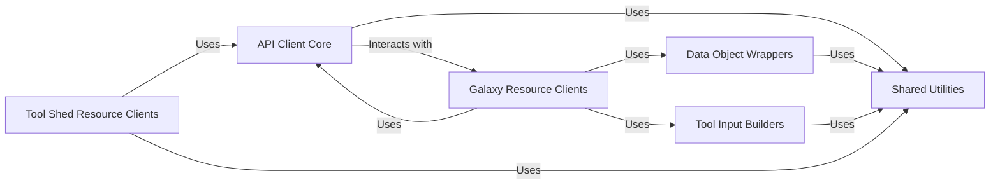

## Details

One paragraph explaining the functionality which is represented by this graph. What the main flow is and what is its purpose.

### Shared Utilities [[Expand]](./Shared_Utilities.md)

This component aggregates general-purpose helper functions and modules that are utilized across various parts of the `bioblend` library. This includes utilities for common tasks such as file attachment, managing asynchronous operations (e.g., waiting for jobs or datasets to complete), and structured input building for complex tool and workflow parameters. It provides reusable functionalities that support the higher-level API interactions.

**Related Classes/Methods**:

- `bioblend/util` (1:1)

### API Client Core

Provides the foundational layer for connecting to and interacting with the Galaxy and Tool Shed APIs. It manages authentication, request dispatching, and response handling.

**Related Classes/Methods**:

- <a href="https://github.com/galaxyproject/bioblend/blob/main/bioblend/galaxyclient.py#L1-L1" target="_blank" rel="noopener noreferrer">`bioblend/galaxyclient` (1:1)</a>

- `bioblend/toolshed` (1:1)

### Galaxy Resource Clients

A collection of client classes, each dedicated to managing specific resources within the Galaxy platform (e.g., histories, datasets, tools, workflows, users, libraries, jobs, etc.). They act as facades over the core API client, providing high-level, resource-specific methods.

**Related Classes/Methods**:

- `bioblend/galaxy/histories` (1:1)

- `bioblend/galaxy/tools` (1:1)

- `bioblend/galaxy/workflows` (1:1)

- `bioblend/galaxy/datasets` (1:1)

- `bioblend/galaxy/dataset_collections` (1:1)

- `bioblend/galaxy/datatypes` (1:1)

- `bioblend/galaxy/ftpfiles` (1:1)

- `bioblend/galaxy/genomes` (1:1)

- `bioblend/galaxy/invocations` (1:1)

- `bioblend/galaxy/jobs` (1:1)

- `bioblend/galaxy/libraries` (1:1)

- `bioblend/galaxy/quotas` (1:1)

- `bioblend/galaxy/roles` (1:1)

- `bioblend/galaxy/tool_data` (1:1)

- `bioblend/galaxy/tool_dependencies` (1:1)

- `bioblend/galaxy/users` (1:1)

- `bioblend/galaxy/visual` (1:1)

- `bioblend/galaxy/forms` (1:1)

- `bioblend/galaxy/groups` (1:1)

- `bioblend/galaxy/container_resolution` (1:1)

### Tool Shed Resource Clients

Similar to Galaxy Resource Clients, these classes provide high-level interfaces for interacting with resources specific to the Galaxy Tool Shed, such as repositories, categories, and tools.

**Related Classes/Methods**:

- `bioblend/toolshed/repositories` (1:1)

- `bioblend/toolshed/categories` (1:1)

- `bioblend/toolshed/tools` (1:1)

### Data Object Wrappers

Defines Python classes that encapsulate the data structures returned by the Galaxy API. These objects provide a more Pythonic and convenient way to access and manipulate API data, abstracting the raw JSON responses.

**Related Classes/Methods**:

- <a href="https://github.com/galaxyproject/bioblend/blob/main/bioblend/galaxy/objects/wrappers.py#L1-L1" target="_blank" rel="noopener noreferrer">`bioblend/galaxy/objects/wrappers` (1:1)</a>

### Tool Input Builders

Provides classes and functions specifically designed to help construct the complex input parameters required for executing tools and workflows on the Galaxy platform. This ensures correct formatting and validation of inputs.

**Related Classes/Methods**:

- <a href="https://github.com/galaxyproject/bioblend/blob/main/bioblend/galaxy/tools/inputs.py#L1-L1" target="_blank" rel="noopener noreferrer">`bioblend/galaxy/tools/inputs` (1:1)</a>

### [FAQ](https://github.com/CodeBoarding/GeneratedOnBoardings/tree/main?tab=readme-ov-file#faq)