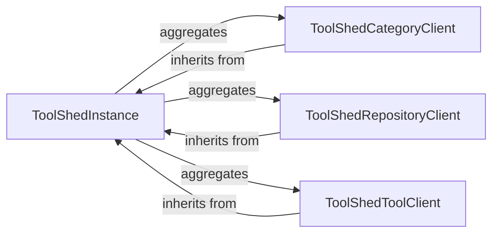

## Details

This component provides a high-level, structured interface for interacting with the Galaxy ToolShed API, adhering to the principles of an SDK/API Client Library. It abstracts the underlying HTTP requests and offers resource-specific clients for managing categories, repositories, and tools within the ToolShed.

### ToolShedInstance

This class serves as the primary entry point for users to interact with the Galaxy ToolShed API. It inherits from `bioblend.galaxyclient.GalaxyClient`, providing the foundational client functionalities for API communication (e.g., connection management, request handling). It acts as a central hub, aggregating and providing access to the resource-specific ToolShed clients.

**Related Classes/Methods**:

- <a href="https://github.com/galaxyproject/bioblend/blob/main/bioblend/galaxyclient.py#L1-L1" target="_blank" rel="noopener noreferrer">`bioblend.galaxyclient.GalaxyClient` (1:1)</a>

### ToolShedCategoryClient

This client is dedicated to managing categories within the Galaxy ToolShed. It provides methods for listing, showing, and potentially creating/updating ToolShed categories. It leverages core API interaction methods from `bioblend.galaxy.client.Client` and ToolShed-specific context from `ToolShedInstance`.

**Related Classes/Methods**:

- <a href="https://github.com/galaxyproject/bioblend/blob/main/bioblend/galaxy/client.py#L1-L1" target="_blank" rel="noopener noreferrer">`bioblend.galaxy.client.Client` (1:1)</a>

- `ToolShedInstance` (1:1)

### ToolShedRepositoryClient

This client handles all operations related to repositories in the Galaxy ToolShed. This includes functionalities like searching, installing, uninstalling, and managing ToolShed repositories. It inherits core API interaction methods from `bioblend.galaxy.client.Client` and ToolShed-specific context from `ToolShedInstance`.

**Related Classes/Methods**:

- <a href="https://github.com/galaxyproject/bioblend/blob/main/bioblend/galaxy/client.py#L1-L1" target="_blank" rel="noopener noreferrer">`bioblend.galaxy.client.Client` (1:1)</a>

- `ToolShedInstance` (1:1)

### ToolShedToolClient

This client focuses on managing tools within the Galaxy ToolShed. It provides methods for interacting with ToolShed tools, such as listing tools, showing tool details, and potentially managing tool dependencies. It inherits core API interaction methods from `bioblend.galaxy.client.Client` and ToolShed-specific context from `ToolShedInstance`.

**Related Classes/Methods**:

- <a href="https://github.com/galaxyproject/bioblend/blob/main/bioblend/galaxy/client.py#L1-L1" target="_blank" rel="noopener noreferrer">`bioblend.galaxy.client.Client` (1:1)</a>

- `ToolShedInstance` (1:1)

### [FAQ](https://github.com/CodeBoarding/GeneratedOnBoardings/tree/main?tab=readme-ov-file#faq)