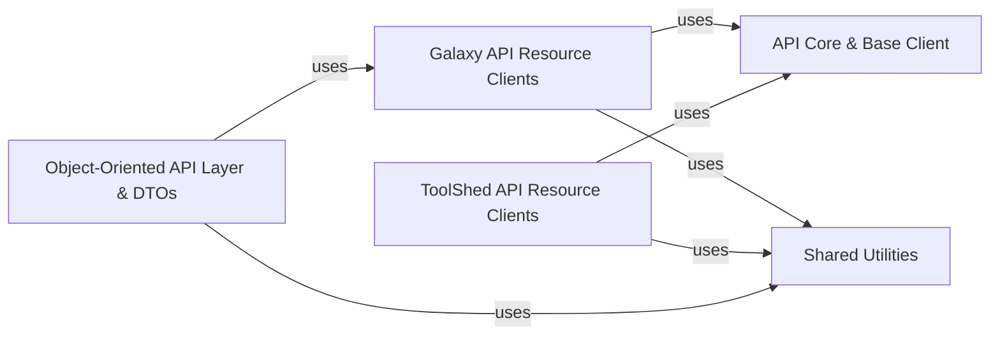

## Details

The `bioblend` library is designed with a clear separation of concerns, enabling robust and user-friendly interaction with Galaxy and ToolShed APIs. The architecture is layered, starting from low-level HTTP communication and building up to high-level, object-oriented interfaces.

### API Core & Base Client

This is the foundational layer responsible for all low-level HTTP communication (GET, POST, PUT, PATCH, DELETE) with both the Galaxy and ToolShed APIs. It manages connection details, handles basic request/response mechanisms, and provides the abstract base for all specific API clients, ensuring consistent interaction patterns. It acts as the direct interface to the external APIs.

**Related Classes/Methods**:

- <a href="https://github.com/galaxyproject/bioblend/blob/main/bioblend/galaxyclient.py" target="_blank" rel="noopener noreferrer">`bioblend.galaxyclient`</a>

- <a href="https://github.com/galaxyproject/bioblend/blob/main/bioblend/galaxy/client.py" target="_blank" rel="noopener noreferrer">`bioblend.galaxy.client`</a>

### Galaxy API Resource Clients

This component provides a comprehensive set of high-level, resource-specific interfaces for interacting with various aspects of the Galaxy API (e.g., histories, tools, workflows, datasets, libraries, jobs, invocations, users). The `GalaxyInstance` class serves as the primary entry point, aggregating and exposing these specialized clients, effectively abstracting the underlying API calls and simplifying the management of Galaxy entities for users.

**Related Classes/Methods**:

- `bioblend.galaxy.GalaxyInstance`

- `bioblend.galaxy.histories`

- `bioblend.galaxy.tools`

- `bioblend.galaxy.workflows`

- `bioblend.galaxy.datasets`

- `bioblend.galaxy.libraries`

- `bioblend.galaxy.jobs`

- `bioblend.galaxy.invocations`

- `bioblend.galaxy.users`

### ToolShed API Resource Clients [[Expand]](./ToolShed_API_Resource_Clients.md)

This component offers high-level interfaces specifically designed for managing resources within the Galaxy ToolShed (e.g., categories, repositories, tools). The `ToolShedInstance` class acts as the main entry point for ToolShed interactions, providing a structured way to access ToolShed functionalities.

**Related Classes/Methods**:

- `bioblend.toolshed.ToolShedInstance`

- `bioblend.toolshed.categories`

- `bioblend.toolshed.repositories`

- `bioblend.toolshed.tools`

### Object-Oriented API Layer & DTOs [[Expand]](./Object_Oriented_API_Layer_DTOs.md)

This component provides an alternative, more Pythonic and object-oriented way to interact with the Galaxy API. It consists of base classes for object-oriented clients and a comprehensive set of Data Transfer Objects (DTOs) that wrap Galaxy entities (such as histories, workflows, and datasets) as native Python objects. These objects offer methods for direct manipulation, state refreshing, and interaction with the Galaxy instance, abstracting away direct API calls.

**Related Classes/Methods**:

- <a href="https://github.com/galaxyproject/bioblend/blob/main/bioblend/galaxy/objects/galaxy_instance.py" target="_blank" rel="noopener noreferrer">`bioblend.galaxy.objects.galaxy_instance`</a>

- <a href="https://github.com/galaxyproject/bioblend/blob/main/bioblend/galaxy/objects/client.py" target="_blank" rel="noopener noreferrer">`bioblend.galaxy.objects.client`</a>

- <a href="https://github.com/galaxyproject/bioblend/blob/main/bioblend/galaxy/objects/wrappers.py" target="_blank" rel="noopener noreferrer">`bioblend.galaxy.objects.wrappers`</a>

### Shared Utilities [[Expand]](./Shared_Utilities.md)

This component aggregates general-purpose helper functions and modules that are utilized across various parts of the `bioblend` library. This includes utilities for common tasks such as file attachment, managing asynchronous operations (e.g., waiting for jobs or datasets to complete), and structured input building for complex tool and workflow parameters. It provides reusable functionalities that support the higher-level API interactions.

**Related Classes/Methods**:

- `bioblend.util`

- <a href="https://github.com/galaxyproject/bioblend/blob/main/bioblend/galaxy/tools/inputs.py" target="_blank" rel="noopener noreferrer">`bioblend.galaxy.tools.inputs`</a>

### [FAQ](https://github.com/CodeBoarding/GeneratedOnBoardings/tree/main?tab=readme-ov-file#faq)